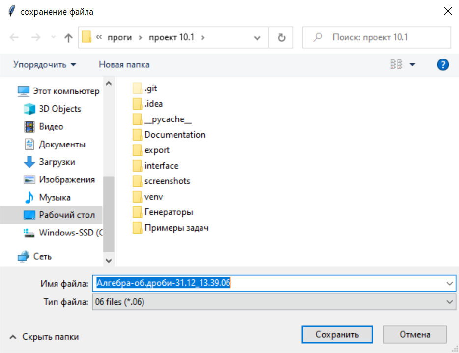

# Генератор заданий
Данная программа позволяет составлять задания для учеников автоматически,
с помощью компьютера.
## Установка
1. Установить на компьютер python. Можно, например,
    [этот](https://www.python.org/downloads/release/python-399/).
    В самом низу страницы будет табличка с вариантами установки. Например, 
    [для Windows x64](https://www.python.org/ftp/python/3.9.9/python-3.9.9-amd64.exe).
2. Нажать `Code` \(зеленая кнопка) - `Download  zip`.
3. Распаковать архив в удобное место.
## Запуск
Запускать  файл `start.vbs`, можно создать на него ярлык.
Первый запуск может быть долгим из-за установки.
## Использование
После запуска программы, пользователю откроется окно с предложением выбрать интересующий его
генератор задач.  

*интерфейс выбора генератора*  

Генератор - это `.py` файл, который хранится где-либо на компьютере. Пока что
есть следующие генераторы:
1. Генератор задач на обыкновенные дроби \(Алгебра).  
`.\Генераторы\Алгебра\Обыкновенные дроби\generator.py`
2. Генератор задач на блоки \(Физика).  
`.\Генераторы\Физика\Блоки\generator.py`
### Генератор задач на обыкновенные дроби
В интерфейсе можно выбрать несколько типов задач из списка, после чего для каждого типа
выбрать настройки уровнясложности и количества задач.  

Типы задач:  
1. Задачи на умение переводить обыкновенные дроби в смешанные и наоборот.
2. Задачи на умение складывать и вычитать дроби с одинаковым знаменателем.
3. Задачи на умение складывать и вычитать дроби с взаимно простыми знаменателями.
4. Задачи на умение складывать и вычитать дроби, где один знаменатель делит другой.
5. Задачи на умение складывать и вычитать дроби, где у знаменателей есть общий множитель.
6. Задачи на умение складывать и вычитать дроби, где знаменатели могут быть любыми.  

Во типах задач 1-5 в примерах по две дроби, а умножение и деление отсутствуют.
Такой выбор задач объясняется тем, что это упражнения на отработку навыков действий с дробями.  

Вывод осуществляется в `.docx` файл. **Внимание! Для этого нужен Word с поддержкой формул**.

  
*интерфейс генератора*  

  
*интерфейс сохранения результата*  
### Генератор задач на блоки
