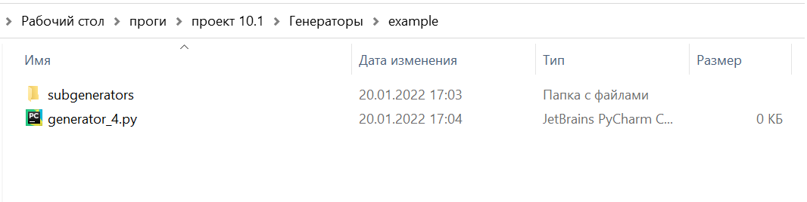
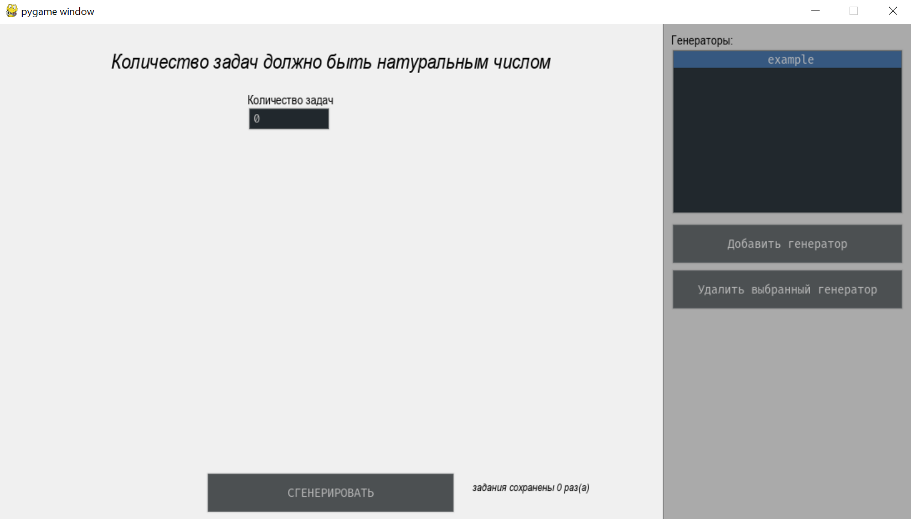
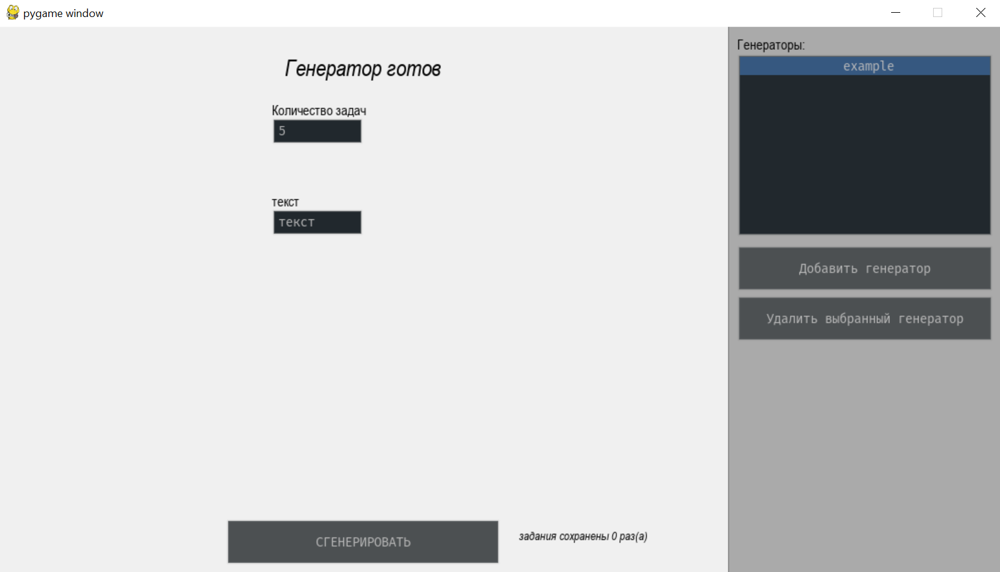

В этом файле будет инструкция по написанию генераторов, а также инструкция по написанию генераторов.


# Общая документация
## interface
### gen_param

> *class* GeneratorParameter *(name: str, type_: str, relative_rect: Tuple[int, int, int, int], description: str = '', \*\*kwargs)*

Этот класс хранит в себе информацию о параметре генерации для генератора.

**Параметры:**
- `name` - имя, под которым параметр будет передаваться в генератор.
- `type_` - тип виджета.
    - `text` - поле ввода текста.
    - `number` - поле ввода числа. То же, что и предыдущее, но не дает ввести не число.
    - `radio_list` - список выбора одного элемента.
    - `check_list` - список выбора нескольких элементов.
    - `slider` - горизонтальный ползунок.
- `relative_rect` - координаты левого верхнего угла, длина и ширина виджета.
- `description` - описание виджета, которое будет отображаться в интерфейсе.
- `**kwargs` - специфические опции для виджетов.
    - `options` - список опций для выбора из списка. Только для `radio_list` и `check_list`
    - `value_range` - крайние значения для `slider`
## export
### word_elements
В этом модуле хранятся классы, которые описывают элементы для экспорта в word. *Если вы пишете генератор, то достаточно просто создать объекты этих классов и вернуть их.* Существуют следующие элементы:
- [`LatexFormula`](#latex_formula) - LaTeX формула. Некоторые функции теряются при конвертации, основное работает.
- [`PageBreak`](#page_break) - разрыв страницы.
- [`Picture`](#picture) - изображение с компьютера.
- [`Text`](#text) - простой текст.
- [`Sentence`](#sentence) - Абзац, состоящий из вышеперечисленного. Но можно вставить вышеперечисленное и без абзаца.
- [`List`](#list_) - список (нумерованный или нет), состоящий из вышеперечисленного.

*Подробнее ниже или по клику по названию.*

#### latex_formula
> *class* LatexFormula *(latex: str, space: float = 3.0)*

Этот класс используется для вставки в docx формулы. Некоторые функции теряются при конвертации, например фигурные скобки в системах, но в остальном работает.

**Параметры:**
 - `latex` - строка с формулой LaTex, без дополнительных символов.
 - `space` - отступ строки вокруг формулы.
**Методы:**:
 - `self.insert(doc: Document)` - Вставляет формулу в указанный документ.

#### page_break
> *class* PageBreak *()*

Данный класс используется для вставки в docx разрыва страницы.

**Методы:**:
 - `self.insert(doc: Document)` - Вставляет разрыв страницы в указанный документ.

#### picture
> *class* Picture *(path, width=None, height=None, inline=False)*

Класс, описывающий картинку в документе.

**Параметры:**
 - `path` - путь к картинке.
 - `width` - ширина картинки в см.
 - `height` - высота картинки в см.
 - `inline` - True, если картинку не надо всталять в отдельный параграф.

Если width и height не заданы - изначальный размер. Если заданы оба - не сохраняет масштаб.

**Методы:**:
 - `self.insert(doc: Document)` - Вставляет картинку в указанный документ.

#### text
> *class* Text *(text : str = '')*

Класс, описывающий текст в документе.

**Параметры:**
 - `text` - текст для вставки.

**Методы:**:
 - `self.insert(doc: Document)` - Вставляет текст в указанный документ.

#### sentence
> *class* Sentence *(elements: list)*

Класс, позволяющий вставить другие элементы (кроме List) в один абзац.

**Параметры:**
 - `elements` - список элементов для вставки.

**Методы:**:
 - `self.insert(doc: Document)` - Вставляет элементы в новый абзац указанного документа.

#### list_
> *class* List *(elements: list, style: str = 'bullet')*

Класс, позволяющий вставлять в docx списки из элементов.

**Параметры:**
 - `elements` - список элементов для вставки.

**Методы:**:
 - `self.insert(doc: Document)` - Вставляет список в указанный документ.


# Инструкция
Инструкция-пример, написанная от первого лица
## создание файлов
Сначала создаем следующие файлы:

В папке генераторы создать папку для своего генератора, в ней папку subgenerators. Для корретной работы импорта все файлы python'а должны иметь разные названия. Поэтому названия файлов должны иметь следующий вид: `БезПродчеркиваний_ID`. У каждого генератора свой ID, они хранятся в файле `Генераторы/Generators_ID.txt`. Все модули, кроме основного генератора должны храниться в папке `subgenerators`, чтобы у пользователей не было вопросов, что открывать. Папка `subgenerators` добавляется в `sys.path`, так что импортировать можно напрямую.

## создание базового генератора
Генератор это объект класса `Generator()`.
Класс должен иметь следующие поля и методы:
 - `needed_params` - список [параметров генератора](#gen_param)
 - `selected_params` - словарь, куда помещать заданные параметры. Так же его можно использовать для задания параметров по умолчанию.
 - `status` - короткая строка, с описанием того, что происходит.
 - `ready` - готов ли генератор к генерации.
 - `new_params` - появились ли у генератора новые запрашиваемые параметры. Если появились - здесь поставить `True`, а `selected_params` - поменять.
 - `set_params(params)` - сеттер для параметров.
 - `generate()` - метод, который будет возвращать результат в виде двух списков из [элементов экспорта](#word_elements)

 Создадим это все:
```python
from interface import GeneratorParameter as GenP  # параметры генератора
from export.word_elements import *  # элементы экспорта


class Generator:
    def __init__(self):
        self.status = 'ожидание параметров'
        self.generated = 0
        self.ready = False
        self.new_params = False

        self.needed_params = []

        self.selected_params = {}

    def set_params(self, params):
        pass

    def generate(self):
        return [], []
```

Запустим систему и убедимся, что все работает:


## получение параметров
Создадим виджет для получения количества генерируемых задач. Для этого изменим `self.needed_params`:
```python
self.needed_params = [
    GenP(name='quantity', type_='number', relative_rect=(300,100,100,30),description='Количество задач')
]
```
[Справка - что такое GenP](#gen_param)
Напишем сеттер:
```python
def set_params(self, params):
    self.ready = True
    self.status = 'Генератор готов'
    for i in params:
        self.selected_params[i] = params[i]
    if not self.selected_params['quantity'].isdigit() or int(self.selected_params['quantity']) <= 0:
        self.ready = False
        self.status = 'Количество задач должно быть натуральным числом'
```
Здесь надо пояснить, что параметры передаются в сеттер в виде словаря, где ключи - названия указанные при создании генератора. Параметры передаются каждый тик, а не только при изменении.

## генерация
В начале импортируем random(`import random`) и напишем функцию для генерации:
```python
def generate(self):
    tasks, answers = [], []
    for i in range(int(self.selected_params['quantity'])):
        a, b = random.randint(1, 100), random.randint(1, 100)
        c = a + b
        tasks.append(LatexFormula('%d + %d' % (a, b)))
        answers.append(LatexFormula('%d + %d = %d' % (a, b, c)))
    return [
                Text('Решите примеры:'),
                List(elements=tasks, style='number')
            ], [
                List(elements=answers, style='number')
            ]
```
Возвращать нужно списки заданий и ответов в виде [элементов экспорта](#word_elements).
После работы системы получится следующий файл:


*Разрыв страниц, надпись "ответы", и название генератора(example) подставляются автоматически*

## изменение параметров
Пусть у нас появится еще один виджет, если количество задач больше 3 и виджета не было раньше. 
Добавим в `__init__` флаг: 
```python
self.__flag = True  # флаг отвечает за отсутствие виджета
```
Добавим в начало сеттера следующую строку:
```python
self.new_params = False
```
Эта строка нужна, чтобы снять флаг `self.new_params`, иначе интерфейс будет перделывать виджеты каждый тик, и редактировать их будет невозможно.

Добавим нужную проверку в сеттер:
```python
if self.__flag and int(self.selected_params['quantity']) > 3:  # флаг отвечает за отсутствие виджета
    self.new_params = True
    self.ready = False
    self.__flag = False
    self.status = 'Ожидание параметров'
    self.needed_params.append(
        GenP(name='txt', type_='text', relative_rect=(300, 200, 100, 30), description='текст'))
    self.selected_params['txt'] = 'текст'  # вариант по умолчанию
```
Теперь при установке количества больше 3 появится еще одно текстовое поле.
Вот так было:

Вот так стало:
